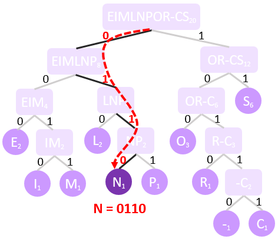
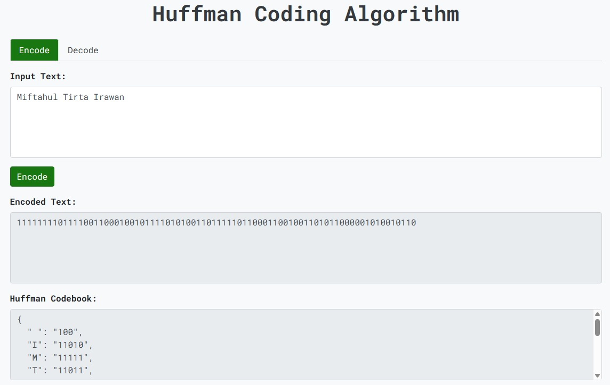

# Huffman Coding Algorithm

This web application allows users to encode and decode text using the Huffman coding algorithm. It provides a modern and intuitive user interface built with Flask and Bootstrap for easy understanding.

## Introduction
The Huffman Coding algorithm is used **to implement lossless compression**. The principle of this algorithm is to **replace each character** or symbols of  a piece of text with a **unique binary code**. However the codes generated may have **different lengths**.

In order to optimize the compression process, the idea behind the Huffman Coding approach is to **associate shorter codes to the most frequently used symbols** and longer codes to the less frequently used symbols.

## Example
Input: `Miftahul Tirta Irawan`

### Process:
1. Calculate the frequency of each character in the input text.

    | Character | Frequency |
    |-----------|-----------|
    | M         | 1         |
    | i         | 3         |
    | f         | 1         |
    | t         | 3         |
    | a         | 3         |
    | h         | 1         |
    | u         | 1         |
    | l         | 2         |
    | (space)   | 2         |
    | T         | 1         |
    | r         | 2         |
    | I         | 1         |
    | w         | 1         |
    | n         | 1         |

2. Construct a binary tree where each leaf node represents a character and its frequency. You can refer to this [great tutorial](https://www.101computing.net/lossless-compression-huffman-coding-algorithm/) on how to do it. The constructed tree will similar to this.
<p align="center">
  
  <br>
  <i>Figure 1: Huffman Coding Path</i>
</p>
3. Traverse the tree to generate a binary code for each character.
```json
{
  " ": "100",
  "I": "11010",
  "M": "11111",
  "T": "11011",
  "a": "00",
  "f": "11110",
  "h": "0100",
  "i": "1110",
  "l": "1010",
  "n": "10110",
  "r": "1100",
  "t": "011",
  "u": "10111",
  "w": "0101"
}
```
4. Replace each character with its corresponding Huffman Code.

```json
{
    "input"     : "Miftahul Tirta Irawan",
    "output"    : "111111110111100110001001011110101001101111101100011001001101011000001010010110"
}
```
5. The decoding process involve creating a reverse mapping from Huffman Codes to characters. It's just a reversed step of encoding.

## Encode/Decode App
For better understanding, I provide a source code of the algorithm and flask web interface to play around with the algorithm. There are two main features within the app. These are:
1. **Encode Text** : Convert input text into Huffman encoded binary string.
2. **Decode Text** : Convert the encoded binary string back into the original text.

### Running the application
1. Start the flask server using ``python app.py`` in the sub-repos directory after you clone it.
2. Open your web browser and navigate to `http://127.0.0.1:5000/`

### Project Structure
```
huffman_web/
    ├── huffman.py               # Huffman coding algorithm implementation
    ├── app.py                   # Flask application
    ├── templates/
    │   └── index.html           # HTML template
    ├── static/
    │   ├── styles.css           # CSS styles
    │   └── script.js            # JavaScript code
    └── README.md                # This README file
```

### Usage
1. **Encode Text**
    - Navigate to the **Encode** tab.
    - Enter your text in the input text area.
    - Click the **Encode** button.
    - The encoded text and Huffman codebook will be displayed.
2. **Decode Text**
    - Navigate to the **Decode** tab.
    - Enter the encoded text and the Huffman codebook from the encoding step. 
    - Click the **Decode** button.
    - The decoded text will be displayed.

### Screenshots
<p align="center">
  
  <br>
  <i>Figure 2: Encoding Screenshot</i>
</p>

<p align="center">
  
  <br>
  <i>Figure 3: Decoding Screenshot</i>
</p>

## Acknowledgements
- The Huffman coding algorithm is a well-known algorithm for loseless data compression. Here are some key areas where Huffman coding is applied:
    - File Compression (ZIP and GZIP)
    - Multimedia Compression (JPEG and MP3)
    - Memory-Constrained Devices
    - Genome Sequencing
    - Portable Document Format (PDF)
- This application uses Flask for the backend and Bootstrap for the frontend.